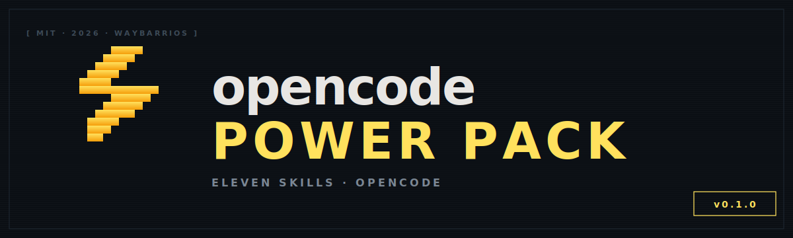

<p align="center">
  
</p>

<p align="center">
  <i>Eleven Claude Code skills, ported to OpenCode.<br/>
  Code review, security audit, feature dev, frontend design, and the rest of the kit — installable in one line.</i>
</p>

<p align="center">
  <a href="https://github.com/waybarrios/opencode-power-pack/blob/main/LICENSE"></a>
  <a href="https://github.com/waybarrios/opencode-power-pack/stargazers"></a>
  <a href="https://github.com/waybarrios/opencode-power-pack/commits/main"></a>
  <a href="https://github.com/waybarrios/opencode-power-pack/issues"></a>
  
  
  
</p>

<p align="center">
  <a href="#installation"><b>Install</b></a> ·
  <a href="#whats-inside"><b>Skills</b></a> ·
  <a href="#slash-commands"><b>Commands</b></a> ·
  <a href="#how-it-works"><b>How it works</b></a> ·
  <a href="#acknowledgments"><b>Credits</b></a> ·
  <a href="LICENSE"><b>License</b></a>
</p>

<p align="center">
  <i>Built on top of <a href="https://github.com/anthropics/claude-code">anthropics/claude-code</a>,
  <a href="https://github.com/anthropics/skills">anthropics/skills</a>,
  <a href="https://github.com/anthropics/claude-code-security-review">anthropics/claude-code-security-review</a>,
  and <a href="https://github.com/obra/superpowers">obra/superpowers</a>. See <a href="#acknowledgments">Acknowledgments</a>.</i>
</p>

---

## Why this exists

OpenCode reads Claude Code's `SKILL.md` format natively, but **most of Anthropic's official Claude Code plugins put their value in `commands/` and `agents/`** — and those are Claude-Code-only. So if you want `/code-review`, `/security-review`, or `/feature-dev` in OpenCode, copy-paste won't get you there.

This pack does the **translation**: the multi-agent workflows from those plugins are rewritten as OpenCode-compatible skills, so the methodology survives the platform jump. Plus a few direct ports of skills that already lived in Anthropic's `skills/` repo.

It pairs nicely with **[obra/superpowers](https://github.com/obra/superpowers)**, which provides the meta-workflow skills (brainstorming, TDD, executing-plans). This pack adds the domain-specific muscle.

---

## What's inside

<table>
<tr>
<th align="left">Category</th>
<th align="left">Skill</th>
<th align="left">Source</th>
<th align="left">Purpose</th>
</tr>

<tr><td rowspan="2"><b>Review</b></td>
<td><code>code-review</code></td>
<td>translated · plugins/code-review</td>
<td>Multi-agent PR review with confidence-filtered cross-checks and reproduction scenarios</td></tr>
<tr><td><code>security-review</code></td>
<td>translated · claude-code-security-review</td>
<td>OWASP-bucketed, three-stage filtering, requires concrete attack PoC per finding</td></tr>

<tr><td rowspan="4"><b>Feature dev</b></td>
<td><code>feature-dev</code></td>
<td>translated · plugins/feature-dev</td>
<td>Seven-phase guided workflow: discovery → exploration → questions → architecture → impl → review → summary</td></tr>
<tr><td><code>code-explorer</code></td>
<td>translated · feature-dev/agents</td>
<td>Deep codebase analysis sub-task — traces a feature end-to-end</td></tr>
<tr><td><code>code-architect</code></td>
<td>translated · feature-dev/agents</td>
<td>Decisive architecture blueprint sub-task with file-level implementation map</td></tr>
<tr><td><code>code-reviewer</code></td>
<td>translated · feature-dev/agents</td>
<td>Two-pass adversarial review sub-task with explicit edge-case checklist</td></tr>

<tr><td><b>Design</b></td>
<td><code>frontend-design</code></td>
<td>copied · plugins/frontend-design</td>
<td>Distinctive, production-grade UI generation that avoids generic AI aesthetics</td></tr>

<tr><td rowspan="2"><b>Authoring</b></td>
<td><code>mcp-builder</code></td>
<td>copied · skills/mcp-builder</td>
<td>Build high-quality MCP servers (Python or TypeScript)</td></tr>
<tr><td><code>skill-creator</code></td>
<td>adapted · skills/skill-creator</td>
<td>Author new SKILL.md files with progressive-disclosure structure</td></tr>

<tr><td rowspan="2"><b>Project memory</b></td>
<td><code>agents-md-improver</code></td>
<td>adapted · plugins/claude-md-management</td>
<td>Audit and update <code>AGENTS.md</code> / <code>CLAUDE.md</code> against the current codebase</td></tr>
<tr><td><code>agents-md-revise</code></td>
<td>translated · claude-md-management/commands</td>
<td>Capture session learnings into project rules — complement to <code>improver</code></td></tr>

</table>

---

## Installation

### Prerequisites

- **OpenCode** installed and on your PATH. If you do not have it: <https://opencode.ai>
- **git** (used by OpenCode to fetch the plugin)
- **Bun** is bundled with OpenCode, so the plugin's `npm install` step at startup is automatic

### Pick an install method

Two paths that work today; pick whichever fits how you plan to use the pack.

| | **A — Install from GitHub** | **B — Install from a local git clone** |
|---|---|---|
| Best for | Just using the pack | Tinkering, contributing, or running offline |
| Requires | Network during first install | A local clone of the repo |
| Updates | `git pull` + cache clear (the cache holds Bun's checkout) | `git pull` updates everything live; symlinks pick up changes immediately |
| Internet at runtime | Only at first install / on cache miss | Never |

Both methods share **steps 2 (symlink commands) and 3 (restart)**. Only step 1 differs.

---

### A — Install from GitHub

**Step 1A.** Add to `~/.config/opencode/opencode.json`:

```jsonc
{
  "$schema": "https://opencode.ai/config.json",
  "plugin": [
    "opencode-power-pack@git+https://github.com/waybarrios/opencode-power-pack.git"
  ]
}
```

If you already use other plugins (e.g. `superpowers`), keep all of them in the array:

```jsonc
{
  "plugin": [
    "superpowers@git+https://github.com/obra/superpowers.git",
    "opencode-power-pack@git+https://github.com/waybarrios/opencode-power-pack.git"
  ]
}
```

To pin a specific tag (recommended once releases exist):

```jsonc
"opencode-power-pack@git+https://github.com/waybarrios/opencode-power-pack.git#v0.2.0"
```

You still need a local copy of the repo for **step 2** (the slash command files live there). Clone it next to wherever you keep code:

```bash
git clone https://github.com/waybarrios/opencode-power-pack.git ~/code/opencode-power-pack
```

Then jump to **step 2 (symlink commands)** below.

---

### B — Install from a local git clone

This avoids the GitHub round-trip entirely. The plugin lives on your disk, and OpenCode reads it via a `file://` URL.

**Step 1B.1.** Clone the repo wherever you keep code:

```bash
git clone https://github.com/waybarrios/opencode-power-pack.git ~/code/opencode-power-pack
```

If the repo is not yet on GitHub and you only have it locally, skip the clone — just point at the existing directory.

**Step 1B.2.** Add to `~/.config/opencode/opencode.json`, using the **absolute path** to your clone:

```jsonc
{
  "$schema": "https://opencode.ai/config.json",
  "plugin": [
    "opencode-power-pack@git+file:///Users/you/code/opencode-power-pack"
  ]
}
```

Notes:

- The `file://` URL needs to be an **absolute path** with three slashes (`file:///Users/...`) and no trailing slash.
- The directory must be a git repo (have a `.git/`). If you copied the files without git, run `git init && git add . && git commit -m init` inside the directory first — Bun's git-style installer requires a real git tree.
- Updating is just `cd ~/code/opencode-power-pack && git pull`, then clear the cache and restart (see [Updating](#updating)).

Then continue to **step 2** below.

### 2. Symlink the slash commands (both methods)

The plugin auto-registers the skills directory programmatically. Slash commands, however, need to live in OpenCode's canonical commands path; the plugin ships physical markdown files under `commands/` for you to symlink in.

```bash
mkdir -p ~/.config/opencode/commands
ln -s ~/code/opencode-power-pack/commands/*.md ~/.config/opencode/commands/
```

Adjust the source path if you cloned somewhere other than `~/code/opencode-power-pack`. If a command of the same name already exists in `~/.config/opencode/commands/`, that file wins — `ln -s` will refuse to overwrite, which is the desired behavior.

If you prefer **copies** over symlinks (e.g. you do not want `git pull` to silently change your commands):

```bash
cp ~/code/opencode-power-pack/commands/*.md ~/.config/opencode/commands/
```

Trade-off: copies are static — you have to re-copy after every `git pull`. Symlinks track the working tree live.

### 3. Restart OpenCode (both methods)

```bash
# kill ALL opencode processes (not just the active TUI)
pkill -f opencode

# clear the npm-style plugin cache so the new version is fetched fresh
rm -rf ~/.cache/opencode/node_modules/opencode-power-pack 2>/dev/null

# start again
opencode
```

### 4. Verify

In a new OpenCode session, run:

```
List the skills you have available.
```

You should see the eleven skills under the `opencode-power-pack:` namespace (or unprefixed, depending on your OpenCode version).

Then hit **`ctrl+p`** to open the command palette and look for any of:

- `code-review`
- `security-review`
- `feature-dev`
- `frontend-design`
- `agents-md-improver`

If they show up, you're done. If not, see [Troubleshooting](#troubleshooting).

---

## Updating

```bash
# 1. Pull the latest skills + commands
cd ~/code/opencode-power-pack
git pull

# 2. If new skills were added, the existing symlinks are unaffected,
#    but new commands need to be linked in:
ln -s ~/code/opencode-power-pack/commands/*.md ~/.config/opencode/commands/ 2>/dev/null

# 3. Clear the plugin cache and restart OpenCode
rm -rf ~/.cache/opencode/node_modules/opencode-power-pack
pkill -f opencode
opencode
```

If you pinned a version in `opencode.json` (e.g. `#v0.2.0`), bump the tag in the JSON before restarting, otherwise OpenCode keeps using the pinned commit.

---

## Uninstalling

```bash
# 1. Remove from opencode.json
#    delete the "opencode-power-pack@..." line from the "plugin" array

# 2. Remove the symlinked commands
for f in ~/code/opencode-power-pack/commands/*.md; do
  rm -f ~/.config/opencode/commands/"$(basename "$f")"
done

# 3. Remove the plugin cache
rm -rf ~/.cache/opencode/node_modules/opencode-power-pack

# 4. Restart OpenCode
pkill -f opencode
opencode

# 5. Optional: delete the local clone
rm -rf ~/code/opencode-power-pack
```

To remove **just one skill** (keeping the rest), delete its symlink only:

```bash
rm ~/.config/opencode/commands/code-review.md
```

The skill itself remains discoverable via the native `skill` tool unless you also remove it from the skills directory, but the slash command will no longer appear.

---

## Troubleshooting

| Symptom | Cause | Fix |
|---|---|---|
| `/code-review` not in command palette | Symlinks not in `~/.config/opencode/commands/` | Re-run the `ln -s` step from Installation |
| `/code-review` shows the old meta-prompt ("If the skill is not yet loaded, load it via the native skill tool…") | Stale plugin cache from a pre-`v0.1.0` build | `rm -rf ~/.cache/opencode/node_modules/opencode-power-pack && pkill -f opencode && opencode` |
| Skills do not appear when you run "list available skills" | Plugin entry missing or misspelled in `opencode.json` | Validate JSON: `python3 -m json.tool ~/.config/opencode/opencode.json` |
| Plugin install fails with a git error | Bad URL, network issue, or private repo | Check the `git+...` URL works manually: `git ls-remote <url>` |
| Symlink command fails on macOS with permission denied | `~/.config/opencode/commands/` does not exist | `mkdir -p ~/.config/opencode/commands` first |
| Command appears but model "rushes" and gives a one-line answer | Local model not following multi-step instructions | Use a stronger backing model. The skill content is correct; small models may still skim. The skills mark themselves as "expected to take multiple minutes" — bigger models honor that. |
| Want to disable for one project | Project-level override | Add `"plugin": []` (empty) to `<project>/.opencode/opencode.json` |

If none of the above match: `tail -f ~/.cache/opencode/log/*.log` while you start OpenCode and look for plugin-load errors.

---

---

## Slash commands

Each skill is exposed as a slash command. The command body inlines the **full skill workflow**, so the model receives the actual instructions as its prompt — not a meta-instruction telling it to load something else.

```
/code-review                Multi-agent PR review with cross-check and reproduction scenarios
/security-review            OWASP-bucketed audit with three-stage filtering and PoC requirement
/feature-dev                Start the 7-phase guided feature workflow
/code-explorer              Trace a feature deeply across the codebase
/code-architect             Produce a complete architecture blueprint for a feature
/code-reviewer              Two-pass adversarial review of a small change set
/frontend-design            Generate a distinctive frontend with a bold aesthetic direction
/mcp-builder                Guide MCP server creation
/skill-creator              Author a new SKILL.md
/agents-md-improver         Audit and improve AGENTS.md / CLAUDE.md
/agents-md-revise           Capture session learnings into the rules file
```

### Examples

```
/code-review --comment
/code-review can you review https://github.com/owner/repo/pull/449
/feature-dev add a logout button to the topbar
/security-review
/frontend-design pricing page, brutalist tone, single-screen
/agents-md-improver
```

If you have a command of the same name in `~/.config/opencode/commands/foo.md` or under `command` in `opencode.json`, **your version wins** — the plugin only registers the skill discovery path, never overwrites a command.

---

## How it works

```
┌─────────────────────────── opencode-power-pack ────────────────────────────┐
│                                                                            │
│   .opencode/plugins/opencode-power-pack.js                                 │
│   ├── exports OpencodePowerPack(ctx) → { config(c) }                       │
│   └── pushes  skills/  into  c.skills.paths   (live config singleton)      │
│                                                                            │
│   skills/<name>/SKILL.md                                                   │
│   └── frontmatter: name + description (+ license)                          │
│       body: the actual workflow the model executes                         │
│                                                                            │
│   commands/<name>.md          ──symlink──▶  ~/.config/opencode/commands/   │
│   ├── frontmatter: description (for menu)                                  │
│   └── body: full inlined SKILL.md content + $ARGUMENTS                     │
│                                                                            │
└────────────────────────────────────────────────────────────────────────────┘
```

**Two surfaces, one source of truth.** The skills directory feeds OpenCode's native `skill` tool (so the model can load any skill on demand). The commands directory feeds the slash-command palette (so you can invoke a skill directly with `/<name>`). Both are generated from the same `SKILL.md` files — edit the SKILL.md, regenerate the command file with the script in the repo, and both paths stay in sync.

The plugin entry-point only registers the skills path. Slash commands are **physical files**, not programmatic — this avoids OpenCode's runtime-config caching gotchas and means you can edit, symlink, or selectively delete commands without touching code.

---

## Scope and non-goals

| In scope | Out of scope |
|---|---|
| Porting Claude Code skills where the methodology is portable | Claude Code slash commands ported as Claude-Code-style commands |
| Translating commands and agents into SKILL.md format | Claude Code hooks |
| Direct copies of `anthropics/skills` skills with attribution | Claude Code output styles |
| OpenCode-native slash commands generated from skills | Anything that breaks if you also use Claude Code |

---

## Contributing

Pull requests welcome, especially for:

- New skill ports (Trail of Bits security skills, language-specific packs from `wshobson/agents`, document skills, etc.)
- Improvements to existing skill instructions based on real-world failure modes
- Tooling to keep `commands/*.md` in sync with `skills/*/SKILL.md` automatically

Skill format must follow the OpenCode spec:

- Directory name matches the `name` frontmatter field
- Lowercase alphanumeric with single hyphens, regex `^[a-z0-9]+(-[a-z0-9]+)*$`
- `description` 1–1024 chars, specific enough to trigger correctly
- Body in markdown, ideally under 500 lines
- Cite the upstream source in `license` frontmatter when porting

---

## Acknowledgments

**This package is not original work.** Almost everything in `skills/` is either a direct copy or a translation of skills, commands, or agent definitions written by **Anthropic** for Claude Code, plus one direct adaptation of the OpenCode plugin pattern from **Jesse Vincent (obra)**. The credit belongs to them; this repo's contribution is the *porting and packaging* for OpenCode.

### Upstream sources

| Upstream | Project | What we use from it |
|---|---|---|
| Anthropic | [`anthropics/claude-code/plugins/code-review`](https://github.com/anthropics/claude-code/tree/main/plugins/code-review) | The four-reviewer parallel-review methodology that became `code-review` |
| Anthropic | [`anthropics/claude-code/plugins/feature-dev`](https://github.com/anthropics/claude-code/tree/main/plugins/feature-dev) | The seven-phase workflow and the three sub-agents (`code-explorer`, `code-architect`, `code-reviewer`) |
| Anthropic | [`anthropics/claude-code/plugins/frontend-design`](https://github.com/anthropics/claude-code/tree/main/plugins/frontend-design) | The `frontend-design` skill (direct copy) |
| Anthropic | [`anthropics/claude-code-security-review`](https://github.com/anthropics/claude-code-security-review) | The `/security-review` slash command, translated and extended |
| Anthropic | [`anthropics/skills/skills/mcp-builder`](https://github.com/anthropics/skills/tree/main/skills/mcp-builder) | The `mcp-builder` skill (direct copy, references stripped) |
| Anthropic | [`anthropics/skills/skills/skill-creator`](https://github.com/anthropics/skills/tree/main/skills/skill-creator) | The `skill-creator` skill (adapted, eval-tooling references trimmed) |
| Anthropic | [`anthropics/claude-plugins-official/.../claude-md-management`](https://github.com/anthropics/claude-plugins-official/tree/main/plugins/claude-md-management) | Renamed to `agents-md-improver` and `agents-md-revise`; covers AGENTS.md too |
| Jesse Vincent (obra) | [`obra/superpowers`](https://github.com/obra/superpowers) | The OpenCode plugin pattern (`config.skills.paths.push(...)`) used in `.opencode/plugins/opencode-power-pack.js` |

### What this repo actually contributes

- The translation of Claude-Code-only artifacts (commands and agents) into the SKILL.md format OpenCode reads natively
- Renaming and adapting `claude-md-improver` / `revise-claude-md` to cover both `AGENTS.md` (OpenCode-native) and `CLAUDE.md` (compatibility)
- Deepening the review skills (`code-review`, `code-reviewer`, `security-review`) with extra reviewers, multi-pass adversarial analysis, mandatory category coverage, and concrete-PoC requirements — the originals were already strong; the ports try to compensate for the smaller models people sometimes run under OpenCode by being more directive
- Bundling everything as a one-line OpenCode plugin, plus generating physical slash command files that inline each skill's full content

Each individual SKILL.md frontmatter includes a `license` field naming its specific upstream. The wrapper code (the plugin JS, the README, the LICENSE) is the only original-work portion of this repo.

If you are one of the upstream authors and you'd like the attribution worded differently — or removed — open an issue and we'll fix it.

## License

MIT for the wrapper code and original work in this repo. Each ported skill cites its upstream source in its frontmatter; upstream Anthropic projects are also MIT-licensed. See [LICENSE](LICENSE) for full attribution.
