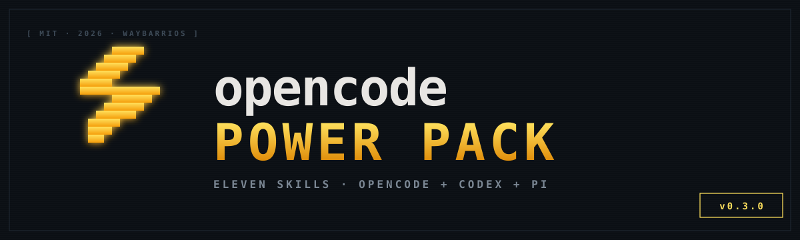

<p align="center">
  
</p>

<h1 align="center">OpenCode Power Pack for Codex, OpenCode + Pi</h1>

<p align="center">
  <i>Twenty Claude Code workflows, adapted for Codex, OpenCode, and Pi.<br/>
  Code review, security audit, feature development, frontend design, project memory, and authoring tools.</i>
</p>

<p align="center">
  <a href="THIRD_PARTY_NOTICES.md"></a>
  <a href="https://github.com/waybarrios/opencode-power-pack/stargazers"></a>
  <a href="https://github.com/waybarrios/opencode-power-pack/commits/main"></a>
  <a href="https://github.com/waybarrios/opencode-power-pack/issues"></a>
  
  
  
  
</p>

<p align="center">
  <a href="#installation"><b>Install</b></a> ·
  <a href="#codex-quick-install"><b>Codex Quick Install</b></a> ·
  <a href="#pi-quick-install"><b>Pi Quick Install</b></a> ·
  <a href="#whats-inside"><b>Skills</b></a> ·
  <a href="#invocation"><b>Invocation</b></a> ·
  <a href="#how-it-works"><b>Architecture</b></a> ·
  <a href="#acknowledgments"><b>Credits</b></a>
</p>

## Codex Quick Install

```bash
codex plugin marketplace add waybarrios/opencode-power-pack --ref main
codex plugin add opencode-power-pack@opencode-power-pack
```

Start a new Codex session, open `/plugins` to confirm the installation, or invoke a workflow explicitly with `$code-review`, `$feature-dev`, `$security-review`, and the other bundled skills.

## Pi Quick Install

```bash
pi install git:github.com/waybarrios/opencode-power-pack
```

Pi discovers the twenty skills declared by the package. Use `pi list` to verify the installation. For a project-local installation recorded in `.pi/settings.json`, add `-l`:

```bash
pi install git:github.com/waybarrios/opencode-power-pack -l
```

## Why This Exists

Codex, OpenCode, and Pi read `SKILL.md` workflows, but many valuable Claude Code workflows originated as Claude-specific commands and agents. Copying those artifacts directly does not preserve their orchestration, permissions, or subagent behavior.

This package adapts the portable methodology into shared skills, registers feature-development specialist roles as read-only OpenCode subagents, lets Codex execute the same phase assignments with its native subagent workflow, and exposes all twenty skills as a Pi package. It ships immutable provenance for every upstream work.

It complements [obra/superpowers](https://github.com/obra/superpowers), which provides process skills such as brainstorming, TDD, debugging, and plan execution.

## What's Inside

| Category | Skill | Purpose |
|---|---|---|
| Review | `code-review` | Multi-agent PR review with confidence filtering and reproduction scenarios |
| Review | `security-review` | Security-focused review with category coverage and exploit-path validation |
| Review | `supply-chain-risk-auditor` | Flag dependencies at heightened risk of exploitation or takeover |
| Review | `sharp-edges` | Identify error-prone APIs and footgun configurations before they cause security mistakes |
| Review | `insecure-defaults` | Detect fail-open insecure defaults (hardcoded secrets, weak auth, permissive config) |
| Review | `fp-check` | Systematically verify a suspected security bug to a TRUE/FALSE POSITIVE verdict |
| Review | `vuln-report` | Draft a single-vulnerability disclosure report in GitHub advisory style |
| Feature development | `feature-dev` | Seven-phase workflow from discovery through implementation and review |
| Feature development | `code-explorer` | Trace a feature across entry points, layers, state, and dependencies |
| Feature development | `code-architect` | Produce a file-level architecture and implementation blueprint |
| Feature development | `code-reviewer` | Adversarial review of a focused local change set |
| Design | `frontend-design` | Create distinctive interfaces with an accessibility and craft rubric |
| Design | `ai-slop` | Rubric to judge whether a design is generic "AI slop" or genuinely product-fit |
| Code quality | `code-quality` | Linting, complexity, and review checklists across Rust, TypeScript, Python, and shell |
| Code quality | `design-patterns` | Pattern trade-offs (when to use, when to skip) for Rust, TS/React, and Django/Python |
| Research | `paper-summarizer` | Extract actionable findings and a claim-evidence map from academic/technical papers |
| Authoring | `mcp-builder` | Design and build MCP servers in TypeScript or Python |
| Authoring | `skill-creator` | Create, test, and improve reusable `SKILL.md` workflows |
| Project memory | `agents-md-improver` | Audit project rules and propose targeted improvements |
| Project memory | `agents-md-revise` | Capture durable session learnings in project rules |

`code-explorer`, `code-architect`, and `code-reviewer` are standalone skills and specialist roles used by `feature-dev`. OpenCode registers named least-privilege agents; Codex can carry out the same assignments with native subagents and can use matching custom agents when the user configures them.

## Installation

### Prerequisites

- Git
- One supported host:
  - OpenCode 1.18.7 or newer: <https://opencode.ai>
  - A current Codex CLI or Codex desktop environment with plugin support: <https://developers.openai.com/codex/>
  - A current Pi coding agent installation: <https://pi.dev/>

### Codex CLI And Desktop

Add this repository as a marketplace, then install the plugin:

```bash
codex plugin marketplace add waybarrios/opencode-power-pack --ref main
codex plugin add opencode-power-pack@opencode-power-pack
codex plugin list --marketplace opencode-power-pack
```

Start a new Codex session after installation so the twenty bundled skills are loaded. Use `/plugins` to inspect the installed plugin or `$` to select one of its skills explicitly. Codex plugin packaging follows the [official plugin structure](https://developers.openai.com/plugins/build/plugins).

### OpenCode From GitHub

```bash
opencode plugin --global "opencode-power-pack@git+https://github.com/waybarrios/opencode-power-pack.git"
```

Restart OpenCode after installation. OpenCode discovers each skill and creates its same-named slash command automatically.

To pin a published release, append its tag:

```bash
opencode plugin --global "opencode-power-pack@git+https://github.com/waybarrios/opencode-power-pack.git#<tag>"
```

### OpenCode From A Local Clone

```bash
git clone https://github.com/waybarrios/opencode-power-pack.git ~/code/opencode-power-pack
opencode plugin --global "opencode-power-pack@git+file:///home/you/code/opencode-power-pack"
```

Use an absolute `file://` URL adjusted for your operating system. The target directory must be a Git repository.

### Pi From GitHub

```bash
pi install git:github.com/waybarrios/opencode-power-pack
```

Pi installs the Git package and loads the `skills/` directory declared in `package.json`. Use `-l` to save it to project settings instead of user settings. See the [Pi package documentation](https://pi.dev/docs/latest/packages) for source, update, filtering, and trust behavior.

### Verify OpenCode

```bash
opencode debug skill
opencode debug agent code-explorer
```

The first command should include all twenty unprefixed skill names. The second should report a `subagent` with editing denied. In the TUI, `ctrl+p` should list `/code-review`, `/feature-dev`, `/frontend-design`, and the other skill-derived commands.

### Verify Codex

```bash
codex plugin list --marketplace opencode-power-pack
```

The list should show `opencode-power-pack` as installed. Start a new session and explicitly select `$code-review`, `$feature-dev`, or another bundled skill for a first test.

### Verify Pi

```bash
pi list
```

The package list should include the Git source for `waybarrios/opencode-power-pack`. Start a new Pi session after installation so its bundled skills are available.

## Updating

For Codex:

```bash
codex plugin marketplace upgrade opencode-power-pack
codex plugin add opencode-power-pack@opencode-power-pack
```

Start a new session after the upgrade.

For Pi:

```bash
pi update git:github.com/waybarrios/opencode-power-pack
```

For an OpenCode GitHub installation:

```bash
opencode plugin --global --force "opencode-power-pack@git+https://github.com/waybarrios/opencode-power-pack.git"
```

Restart OpenCode after the command finishes. For a pinned installation, update the tag first. Local-clone users should run `git pull` in the clone and reinstall with the same `git+file://` spec.

## Uninstalling

For Codex:

```bash
codex plugin remove opencode-power-pack@opencode-power-pack
```

For Pi:

```bash
pi remove git:github.com/waybarrios/opencode-power-pack
```

For OpenCode, remove the `opencode-power-pack@...` entry from the `plugin` array in the config where it was installed, then restart OpenCode. There are no command symlinks or copied command files to remove.

## Troubleshooting

| Symptom | Cause | Fix |
|---|---|---|
| Codex cannot find the marketplace | Marketplace snapshot is missing or stale | Run `codex plugin marketplace add waybarrios/opencode-power-pack --ref main`, or upgrade the existing marketplace |
| Codex installed the plugin but skills do not appear | The current session predates installation | Start a new Codex session and inspect `/plugins` |
| Pi does not show the skills | Package is absent, disabled, or the session predates installation | Run `pi list`, inspect `pi config`, and start a new Pi session |
| Skills or commands do not appear | OpenCode is older than 1.18.7 | Upgrade OpenCode, restart, and run `opencode debug skill` |
| Skills are missing from debug output | Plugin installation failed or its config entry is absent | Re-run `opencode plugin --global --force <module-spec>` and inspect the reported error |
| Specialist agents are missing | Stale plugin checkout | Force reinstall, restart, and run `opencode debug agent code-explorer` |
| Installation reports a Git error | Invalid URL, network failure, or inaccessible repository | Validate the source with `git ls-remote <url>` |
| A workflow is rushed or incomplete | The backing model skipped multi-stage instructions | Use a stronger model and inspect whether required subagent tools are available |

## Invocation

Codex exposes installed skills through `$` mentions, OpenCode 1.18.7+ exposes each discovered skill as a same-named slash command, and Pi loads the workflows from the installed skills package:

```text
/code-review
/security-review
/feature-dev
/code-explorer
/code-architect
/code-reviewer
/frontend-design
/mcp-builder
/skill-creator
/agents-md-improver
/agents-md-revise
```

Examples:

```text
$code-review review the current branch against main
$feature-dev add a logout button to the topbar
/code-review --comment
/code-review review https://github.com/owner/repo/pull/449
/feature-dev add a logout button to the topbar
/security-review
/frontend-design pricing page, brutalist tone, single-screen
```

In OpenCode, an explicit command with the same name takes precedence over a skill-derived command.

## How It Works

```text
opencode-power-pack
|
+-- .codex-plugin/plugin.json
|   +-- packages all skills/ for Codex and compatible plugin surfaces
|
+-- .agents/plugins/marketplace.json
|   +-- exposes the repository as an installable Codex marketplace
|
+-- package.json
|   +-- declares skills/ as a Pi package for pi install
|
+-- .opencode/plugins/opencode-power-pack.js
|   +-- registers skills/ in config.skills.paths
|   +-- registers code-explorer as a read-only subagent
|   +-- registers code-architect as a read-only subagent
|   +-- registers code-reviewer with read-only Git commands
|
+-- skills/<name>/SKILL.md
|   +-- shared Codex/OpenCode workflow
|   +-- host-native invocation metadata
|   +-- immutable source and license metadata
|
+-- UPSTREAMS.json
    +-- repository, commit, path, blob, date, and adaptation type
```

Each `SKILL.md` is the single source for its workflow. The OpenCode plugin derives specialist-agent prompts from those files at startup. Codex loads the same skills from the plugin and follows `feature-dev`'s specialist assignments with its native subagent workflow; installing a skill does not itself create a named custom agent.

The packaged agents deny edits, external network access, and nested tasks. `code-reviewer` additionally allows a narrow set of read-only Git commands.

## Scope And Non-Goals

| In scope | Out of scope |
|---|---|
| Portable Claude Code workflow methodology | Claude Code hook contracts |
| Codex, OpenCode, and Pi skills, invocation, and subagent orchestration | Proprietary or non-redistributable plugins |
| Licensed adaptations with immutable provenance | Automatic trust of third-party skill catalogs |
| Explicit permission boundaries and regression tests | Supporting OpenCode versions older than 1.18.7 or obsolete Codex plugin formats |

## Contributing

Contributions are welcome for:

- Improvements based on reproducible workflow failures
- Behavioral evaluations and adversarial fixtures
- Portable references and deterministic helper scripts
- New ports with a verified license and immutable upstream source

Before opening a PR:

```bash
npm test
npm run smoke:opencode
npm pack --dry-run
```

Live behavioral evaluation is opt-in, needs `OPENCODE_EVAL_MODEL`, and runs only from a source checkout:

```bash
OPENCODE_EVAL_MODEL=provider/model npm run eval:behavioral
```

See [`evals/behavioral/README.md`](evals/behavioral/README.md) for the replay, review, and acceptance workflow. Snapshots are content-addressed evidence from one reviewed model execution, not universal guarantees.

Every skill must use a lowercase hyphenated directory/name, provide a trigger-specific description, remain under 500 lines where practical, and record its exact upstream in `UPSTREAMS.json`.

## Acknowledgments

The bundled skills are modified upstream works. This repository contributes their Codex, OpenCode, and Pi adaptation, packaging, additional workflow guidance, tests, and compatibility layer.

| Upstream | Pinned source | Used for |
|---|---|---|
| Anthropic | [`claude-plugins-official@bdca23e8`](https://github.com/anthropics/claude-plugins-official/tree/bdca23e8e46f8832d0030c05804ae207786ae37f) | Code review, feature development, frontend design, and project memory |
| Anthropic | [`skills@5128e186`](https://github.com/anthropics/skills/tree/5128e1865d670f5d6c9cef000e6dfc4e951fb5b9) | MCP Builder and Skill Creator |
| Anthropic | [`claude-code-security-review@0c6a49f1`](https://github.com/anthropics/claude-code-security-review/tree/0c6a49f1fa56a1d472575da86a94dbc1edb78eda) | Security Review |
| Jesse Vincent | [`superpowers@6efe32c9`](https://github.com/obra/superpowers/tree/6efe32c9e2dd002d0c394e861e0529675d1ab32e) | OpenCode plugin registration pattern |

See [`UPSTREAMS.json`](UPSTREAMS.json) for exact source paths and Git blobs. See [`THIRD_PARTY_NOTICES.md`](THIRD_PARTY_NOTICES.md) for attribution and modification notices.

## License

The wrapper code and original project material are MIT-licensed under [LICENSE](LICENSE). Modified skills derived from Anthropic's official plugins and skills are Apache-2.0, except `security-review`, whose upstream is MIT. See [THIRD_PARTY_NOTICES.md](THIRD_PARTY_NOTICES.md), [UPSTREAMS.json](UPSTREAMS.json), and [LICENSES/](LICENSES/) for exact terms.
